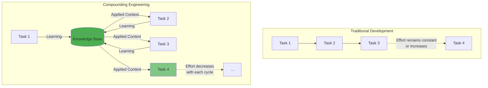

# Compounding Engineering Philosophy

## The Core Principle

> **Each unit of engineering work should make subsequent units of work easier—not harder.**

This simple principle has profound implications for how we approach software development.

## The Problem with Traditional Development

In most software projects, technical debt accumulates over time:

- **Repeated Mistakes**: The same bugs appear in different parts of the codebase
- **Lost Context**: Decisions and learnings are forgotten or buried in Slack/email
- **Manual Documentation**: Writing and maintaining docs is a chore that falls behind
- **Static Tools**: Linters and analyzers don't learn from your specific patterns

The result? **Each new feature becomes harder than the last.**

## The Compounding Alternative

Compounding Engineering flips this around by **automatically capturing and reapplying knowledge**:



## The Four Steps

### 1. Plan
- AI researches your repository structure
- Analyzes similar patterns in your codebase
- **Applies learnings from past plans**
- Generates detailed implementation steps

### 2. Delegate (Execute)
- AI uses ReAct reasoning to make changes
- Directly manipulates files with precision
- **Follows patterns from past successful implementations**
- Executes in isolated worktrees for safety

### 3. Assess (Review)
- Multi-agent review with specialized perspectives
- **Checks against past vulnerabilities and mistakes**
- Generates actionable findings
- Prioritizes based on impact

### 4. Codify
- **Automatically extracts learnings** from each completed task
- Stores patterns, decisions, and solutions
- Organizes knowledge for easy retrieval
- **Injects relevant learnings into future operations**

## What Gets Codified?

The system automatically captures:

- **Patterns**: "Always validate user input at API boundaries"
- **Decisions**: "Use PostgreSQL JSON columns for flexible data"
- **Solutions**: "Fixed N+1 query by eager loading associations"
- **Standards**: "Prefer composition over inheritance"
- **Gotchas**: "Remember to update both cache and database"

All stored as structured JSON and summarized in `AI.md`.

## The Compounding Effect

After 10 cycles:

- Common mistakes are **proactively prevented**
- Code reviews focus on **novel issues**, not repetitive ones
- AI suggestions are **tailored to your codebase**
- Documentation writes itself

After 100 cycles:

- The system knows your architecture patterns intimately
- Similar features are implemented **with minimal guidance**
- Code quality is **consistently high**
- Onboarding is **accelerated** (new devs learn from accumulated knowledge)

## Real-World Example

**Cycle 1:** SQL injection found in user service
```python
# Before (vulnerable)
query = f"SELECT * FROM users WHERE id = {user_id}"

# After (fixed) 
query = "SELECT * FROM users WHERE id = %s"
cursor.execute(query, (user_id,))
```

**Learning captured:** "Always use parameterized queries for SQL operations"

**Cycle 5:** New feature adds admin service
- Review agent **proactively checks** for parameterized queries
- AI work agent **automatically uses** parameterized queries
- No SQL injection issues found

**Cycle 20:** New developer joins
- Reads `AI.md` and learns "parameterized queries" is a team standard
- AI assists them in following the pattern
- **Zero SQL injection bugs from day one**

## Key Differences

| Aspect | Manual Documentation | Compounding Engineering |
|--------|---------------------|------------------------|
| **Capture** | Manual, often skipped | Automatic on every task |
| **Retrieval** | Search docs, hope it's there | Auto-injected into relevant operations |
| **Relevance** | Might be outdated | Fresh, based on recent work |
| **Application** | Developer must remember | AI applies automatically |
| **Coverage** | High-level guidelines only | Specific patterns and solutions |

## The Knowledge Base

All learnings are stored in `.knowledge/` as structured JSON:

```json
{
  "id": "20251206134500",
  "category": "security",
  "summary": "SQL Injection Prevention Pattern",
  "content": "Always use parameterized queries...",
  "tags": ["sql", "security", "validation"],
  "source": "todo_001_resolution",
  "timestamp": "2025-12-06T13:45:00Z"
}
```

And summarized in human-readable `AI.md`:

```markdown
## Security Patterns

### SQL Injection Prevention
- **Pattern**: Always use parameterized queries
- **Example**: `cursor.execute(query, (user_id,))`
- **Source**: Resolved in todo_001
- **Date**: 2025-12-06
```

## How It's Different

Unlike GitHub Copilot or ChatGPT:

- **Specific to your codebase**: Learns YOUR patterns, not generic ones from the internet
- **Cumulative**: Each task builds on the last
- **Automatic**: No prompt engineering or context pasting required
- **Persistent**: Knowledge survives across sessions, projects, and team members

## Origins

This philosophy was developed by [Kieran Klaassen](https://github.com/kieranklaassen) at [Every.to](https://every.to) and documented in the article: [My AI Had Already Fixed the Code Before I Saw It](https://every.to/source-code/my-ai-had-already-fixed-the-code-before-i-saw-it).

This DSPy implementation extends the original concept with:

- Multi-provider LLM support (not just Claude)
- Parallel execution with git worktrees
- Structured knowledge base with retrieval
- Multiple specialized review agents

---

**The result?** Each cycle compounds. Work gets easier. Quality increases. Time to value decreases.

That's compounding engineering.
