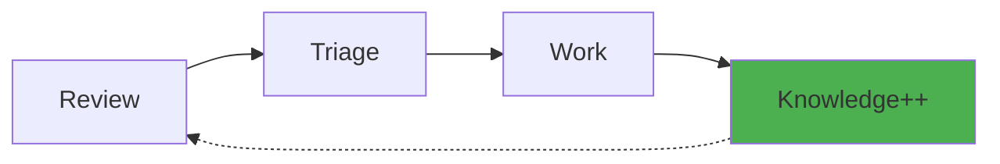

# Quick Start

This guide will walk you through your first compounding engineering cycle.

## Your First Cycle

The compounding engineering workflow follows this pattern:



Let's go through each step!

## Step 1: Review Your Code

Run a multi-agent code review on your current changes:

```bash
uv run python cli.py review
```

This will:

1. Detect your git changes (unstaged changes, or since last commit)
2. Run 10+ specialized review agents in parallel
3. Generate findings in `todos/` directory

!!! tip "Review Options"
    - `--project` - Review entire project (not just changes)
    - URL - Review a specific GitHub PR

**Example output:**

```
🔍 Running Multi-Agent Code Review...
├─ Security Sentinel: Checking for vulnerabilities...
├─ Performance Oracle: Analyzing algorithmic complexity...
├─ Architecture Strategist: Reviewing design patterns...
└─ ... (8 more agents)

✅ Review complete! Found 5 issues:
   - 2 P1 (High priority)
   - 3 P2 (Medium priority)
```

## Step 2: Triage Findings

Review and prioritize the findings:

```bash
uv run python cli.py triage
```

For each finding, you can:

- **Yes** - Approve and mark as ready to work on
- **Next** - Skip or delete
- **All** - Batch approve all remaining
- **Custom** - Adjust priority or details

**Interactive prompt:**

```
📋 Triage Findings (1/5)
━━━━━━━━━━━━━━━━━━━━━━━━━━━━━
Priority: P1
Agent: Security Sentinel
Issue: Potential SQL injection in user_service.py

[Details of the finding...]

Action? [yes/next/all/custom]:
```

## Step 3: Execute Work

Let AI fix the approved issues:

```bash
# Fix all P1 (high priority) issues
uv run python cli.py work p1

# Or fix a specific todo by ID
uv run python cli.py work 001

# Or use worktree mode for safe isolation
uv run python cli.py work p1 --worktree
```

This will:

1. Read each todo and analyze the required changes
2. Use ReAct reasoning to plan and execute file operations
3. Make the necessary code changes
4. **Automatically extract and store learnings**
5. Mark todos as complete

**Example output:**

```
🤖 Resolving todos with priority: p1

📝 Todo 001: Fix SQL injection vulnerability
├─ Analyzing: user_service.py
├─ Planning: Use parameterized queries
├─ Executing: Replacing string concatenation...
└─ ✅ Complete! Learning captured: "Always use parameterized queries for SQL"

📝 Todo 002: Add input validation
├─ Analyzing: api/user_routes.py
└─ ✅ Complete! Learning captured: "Validate all user inputs at API boundaries"

🎉 All P1 todos resolved!
📚 Knowledge Base updated with 2 new learnings
```

## Step 4: See the Compounding Effect

The knowledge from step 3 is now permanently stored. Next time you review code:

- Similar SQL injection patterns will be **auto-detected**
- Missing input validation will trigger **proactive warnings**
- Your system knows your team's patterns and standards

Run another review to see the difference:

```bash
uv run python cli.py review
```

**You might see:**

```
🧠 Knowledge Base: Applying 2 learnings from past work...
   ✓ SQL parameterization pattern
   ✓ Input validation standard

🔍 Review complete! 
   - No SQL injection issues found ✨
   - All inputs properly validated ✨
```

## Beyond the Basics

### Planning New Features

Generate an implementation plan:

```bash
uv run python cli.py plan "Add OAuth authentication"
```

The system will:

- Research your repository structure
- Find similar patterns in your codebase
- Apply knowledge base learnings
- Generate a detailed plan in `plans/`

### Execute a Plan

```bash
uv run python cli.py work plans/add-oauth-auth.md
```

### View Your Knowledge

Check what the system has learned:

```bash
cat .knowledge/AI.md
```

This file contains all accumulated learnings, automatically organized and summarized.

### Codify Manual Learnings

Manually add important patterns:

```bash
uv run python cli.py codify "Always use dependency injection for testability"
```

## Workflow Tips

!!! tip "Best Practices"
    - Run `review` frequently (after each feature or daily)
    - Triage immediately - don't let findings pile up
    - Use `--dry-run` mode to preview changes: `work p1 --dry-run`
    - Review `.knowledge/AI.md` weekly to see your growing knowledge
    - Use `--worktree` for risky changes to keep your branch clean

!!! warning "Start Small"
    For your first few cycles:
    
    - Review small changes (1-2 files)
    - Triage carefully and start with low-priority items
    - Use `--dry-run` mode until comfortable

## Next Steps

Now that you understand the basic workflow:

- **[Code Review Guide](../usage/review.md)** - Deep dive into review agents
- **[Work Execution](../usage/work.md)** - Advanced work options
- **[Architecture](../concepts/architecture.md)** - How it all works

---

**Congratulations!** You've completed your first compounding engineering cycle. Each cycle from here makes the next one easier. 🎉
