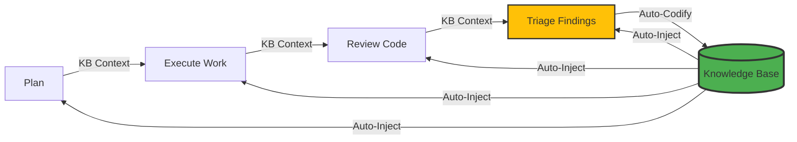

# Compounding Engineering (DSPy Edition)

<p align="center">


</p>

<p align="center">
<strong>Each unit of engineering work should make subsequent units of work easier—not harder.</strong>
</p>

## What is Compounding Engineering?

Compounding Engineering is a philosophy where every task you complete makes the next one easier. This isn't just about reusing code—it's about systematically extracting learnings, patterns, and decisions from each piece of work and automatically applying them to future tasks.

This CLI tool implements that philosophy using [DSPy](https://github.com/stanfordnlp/dspy), providing AI-powered development tools for:

- 🔍 **Multi-Agent Code Review** - 10+ specialized reviewers working in parallel
- 🤖 **Intelligent Work Execution** - ReAct-based file editing with reasoning
- 📋 **Smart Planning** - Repository-aware feature planning
- ✅ **Interactive Triage** - Manage and prioritize findings
- 🧠 **Knowledge Accumulation** - Every action strengthens the system

## Key Features

### 🧠 True Compounding Intelligence

Unlike traditional tools, this system **learns and improves** with every use:

- **Auto-Learning**: Every todo resolution automatically codifies learnings
- **KB Auto-Injection**: Past learnings automatically inform all AI operations
- **Pattern Recognition**: Similar issues are prevented based on past resolutions
- **Knowledge Accumulation**: The system gets smarter with every use

### 🔍 Multi-Agent Code Review

Run 10+ specialized review agents in parallel, each focusing on different aspects:

- **Security Sentinel** - Detects vulnerabilities (SQLi, XSS, CSRF, etc.)
- **Performance Oracle** - Identifies bottlenecks and algorithmic issues
- **Architecture Strategist** - Reviews design patterns and SOLID principles
- **Data Integrity Guardian** - Checks transaction safety and validation
- And many more specialized reviewers...

All agents benefit from your accumulated knowledge base.

### 🛡️ Secure Work Execution

Execute AI-generated plans safely with flexible modes:

- **In-place execution** (default) - Direct file modifications
- **Isolated worktrees** (`--worktree`) - Safe parallel execution in git worktrees
- **Parallel processing** - Multi-threaded todo resolution
- **Auto-codification** - Every resolution creates learnings for future use

### 📚 Knowledge Base

The heart of the compounding system:



## Quick Example

```bash
# 1. Review your code changes
uv run python cli.py review

# 2. Triage the findings
uv run python cli.py triage

# 3. Let AI fix the issues (automatically learns from the process)
uv run python cli.py work p1

# 4. The system now knows how to prevent similar issues!
```

Each cycle makes the next one easier. That's compounding engineering.

## Why This Tool?

| Traditional Tools | Compounding Engineering |
|------------------|-------------------------|
| Same issues repeated | **Patterns learned and prevented** |
| Manual documentation | **Auto-codification of learnings** |
| Context lost between tasks | **Knowledge automatically applied** |
| Static capabilities | **System improves with use** |

## Get Started

Ready to experience compounding engineering?

**:material-download: [Installation Guide](getting-started/installation.md)** - Get up and running in minutes

**:material-rocket-launch: [Quick Start](getting-started/quickstart.md)** - Your first compounding engineering cycle

**:material-cog: [Configuration](getting-started/configuration.md)** - Set up your LLM provider

**:material-book-open-page-variant: [Usage Guide](usage/review.md)** - Learn the core workflows

## Philosophy

Based on the [Compounding Engineering](https://every.to/source-code/my-ai-had-already-fixed-the-code-before-i-saw-it) philosophy by Kieran Klaassen:

- **Plan → Delegate → Assess → Codify** - Systematic workflow
- **Each unit of work makes subsequent work easier** - Knowledge accumulation
- **Systematic beats heroic** - Automated learning and reuse
- **Quality compounds over time** - System gets smarter with use

---

<p align="center">
<a href="https://github.com/Strategic-Automation/dspy-compounding-engineering">View on GitHub</a> | 
<a href="https://github.com/Strategic-Automation/dspy-compounding-engineering/issues">Report Issue</a> | 
<a href="contributing.md">Contribute</a>
</p>

